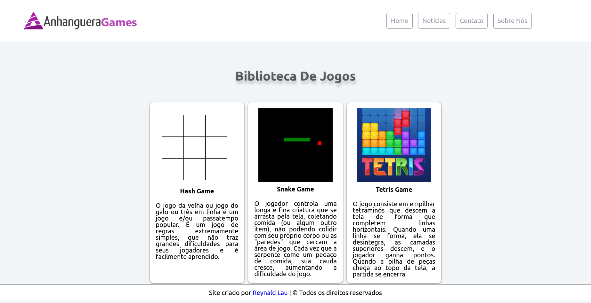
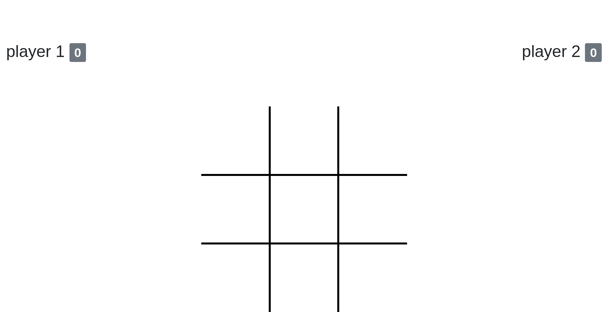

# Anhanguera Games

Anhanguera Games é um projeto é uma inspiração ao site da Faculdade Anhanguera, o site da Anhanguera não possui games então tive a ideia de criar uma página só para jogos para os alunos se divertirem enquanto estudam.

## Índice

- [Overview](#overview)
  - [Screenshots](#screenshots)
  - [Links](#links)
- [Meu processo](#meu-processo)
  - [Desenvolvido com](#desenvolvido-com)
  - [O que eu aprendi](#o-que-eu-aprendi)
- [Autor](#autor)

## Overview

### Screenshot

#### Página Inicial - Desktop 1440px

#### Hash Game

#### Snake Game

#### Tetris

### Links

- Link do site: [https://reynald-durans.github.io/AnhangueraGames/](https://reynald-durans.github.io/AnhangueraGames/)

## Meu processo

### Desenvolvido com

- Semantic HTML5 markup
- CSS custom properties
- Flexbox

### O que eu aprendi

Esse projeto foi uma atividade em sala de aula na minha faculdade com o intuito de aprender sobre hospedagem para web, caminhos de pastas, configuração do arquivo htaccess, etc.

## Autor

- Website - Reynald